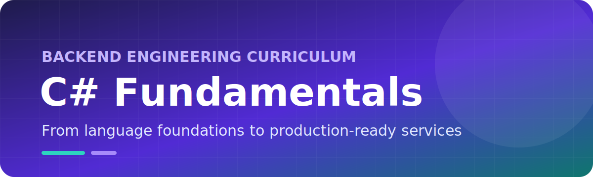
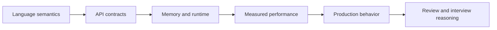

<div align="center">
  

  [](https://learn.microsoft.com/dotnet/csharp/)
  [](https://dotnet.microsoft.com/)
  [](#module-index)
  [](./LICENSE)
</div>

# C# Engineering Fundamentals

A production-focused reference for C# language semantics, runtime behavior, API design, performance, and enterprise application development.

This repository is not organized as a syntax tutorial. Each module is an engineering dossier containing theory, memory and performance analysis, production notes, failure patterns, review guidance, senior interview questions, and compileable backend examples.

## Table of Contents

- [Engineering Model](#engineering-model)
- [Module Index](#module-index)
- [Documentation Standard](#documentation-standard)
- [Runnable Scenarios](#runnable-scenarios)
- [Build and Validate](#build-and-validate)
- [Repository Structure](#repository-structure)
- [Contribution Standard](#contribution-standard)

## Engineering Model



## Module Index

| Module | Engineering area | Code examples |
| ---: | --- | ---: |
| [01](./src/CSharpFundamentals/CSharpFundamentals/Modules/01-Variables/README.md) | Variables and State | 4 |
| [02](./src/CSharpFundamentals/CSharpFundamentals/Modules/02-DataTypes/README.md) | Data Types and Representation | 5 |
| [03](./src/CSharpFundamentals/CSharpFundamentals/Modules/03-TypeConversion/README.md) | Type Conversion and Boundary Parsing | 5 |
| [04](./src/CSharpFundamentals/CSharpFundamentals/Modules/04-Operators/README.md) | Operators and Expression Semantics | 8 |
| [05](./src/CSharpFundamentals/CSharpFundamentals/Modules/05-Strings/README.md) | Strings, Text, Culture, and Encoding | 8 |
| [06](./src/CSharpFundamentals/CSharpFundamentals/Modules/06-Arrays/README.md) | Arrays, Spans, and Contiguous Memory | 8 |
| [07](./src/CSharpFundamentals/CSharpFundamentals/Modules/07-Methods/README.md) | Methods, Contracts, and API Shape | 4 |
| [08](./src/CSharpFundamentals/CSharpFundamentals/Modules/08-ControlFlow/README.md) | Control Flow and Business Decisions | 4 |
| [09](./src/CSharpFundamentals/CSharpFundamentals/Modules/09-ExceptionHandling/README.md) | Exceptions, Resilience, and Failure Semantics | 4 |
| [10](./src/CSharpFundamentals/CSharpFundamentals/Modules/10-Namespaces/README.md) | Namespaces, Assemblies, and Dependency Boundaries | 4 |

## Documentation Standard

Every module contains:

- `README.md` — decision-oriented overview and navigation;
- `Theory.md` — language and runtime semantics;
- `BestPractices.md` — implementation and review checklist;
- `CommonMistakes.md` — production failure patterns;
- `InterviewQuestions.md` — 10 senior-level questions with answers;
- `ProductionNotes.md` — enterprise use, memory, performance, and Microsoft-aligned recommendations;
- compileable `.cs` examples using orders, payments, users, claims, services, and infrastructure boundaries.

## Runnable Scenarios

The application includes executable order processing, payment validation, and notification dispatch examples.

```bash
dotnet run --project src/CSharpFundamentals/CSharpFundamentals/CSharpFundamentals.csproj
dotnet run --project src/CSharpFundamentals/CSharpFundamentals/CSharpFundamentals.csproj -- payment
```

See the [execution guide](./examples/README.md).

## Build and Validate

Requires the [.NET 10 SDK](https://dotnet.microsoft.com/download/dotnet/10.0).

```bash
dotnet restore src/CSharpFundamentals/CSharpFundamentals.slnx
dotnet build src/CSharpFundamentals/CSharpFundamentals.slnx --configuration Release
```

## Repository Structure

```text
csharp-fundamentals/
├── assets/
├── examples/
└── src/CSharpFundamentals/CSharpFundamentals/
    ├── Examples/                  # Executable cross-topic scenarios
    └── Modules/
        ├── 01-Variables/
        ├── 02-DataTypes/
        ├── 03-TypeConversion/
        ├── 04-Operators/
        ├── 05-Strings/
        ├── 06-Arrays/
        ├── 07-Methods/
        ├── 08-ControlFlow/
        ├── 09-ExceptionHandling/
        └── 10-Namespaces/
```

## Contribution Standard

- Explain the production decision, not only the syntax.
- Keep examples compileable and domain-oriented.
- Include memory, performance, failure, and testing implications.
- Prefer primary Microsoft references.
- Avoid toy models, empty placeholders, and unexplained snippets.

## License

Distributed under the [MIT License](./LICENSE).

---

<div align="center">C# semantics connected to production engineering decisions.</div>
