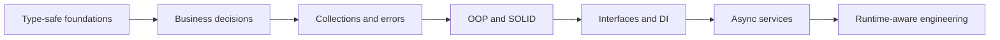

<div align="center">
  

  <br />

  [](https://learn.microsoft.com/dotnet/csharp/)
  [](https://dotnet.microsoft.com/)
  [](./docs/README.md)
  [](./LICENSE)
</div>

# C# Fundamentals

A practical C# curriculum connecting language features to maintainable .NET backend services.

The repository teaches through orders, payments, users, notifications, claims, repositories, and background processing. It avoids isolated toy models and explains how each feature affects correctness, testability, performance, and operations.

> [!NOTE]
> Examples focus on one concept. Production systems still require security, observability, persistence design, and tests appropriate to their risk.

## Table of Contents

- [Learning Path](#learning-path)
- [Quick Navigation](#quick-navigation)
- [Curriculum](#curriculum)
- [Repository Structure](#repository-structure)
- [Run the Example](#run-the-example)
- [Learning Method](#learning-method)
- [Contributing](#contributing)
- [License](#license)

## Learning Path



## Quick Navigation

| Goal | Start here |
| --- | --- |
| Learn language foundations | [Variables, Types, and Nullability](./docs/beginner/variables-and-types.md) |
| Write clear business logic | [Control Flow and Method Design](./docs/beginner/control-flow-and-methods.md) |
| Design maintainable services | [Object-Oriented Design and SOLID](./docs/intermediate/object-oriented-design.md) |
| Understand composition | [Interfaces and Dependency Injection](./docs/intermediate/interfaces-and-dependency-injection.md) |
| Build responsive backends | [Async/Await and Cancellation](./docs/intermediate/async-await.md) |
| Diagnose runtime trade-offs | [Memory, Allocation, and Performance](./docs/advanced/memory-and-performance.md) |

## Curriculum

| Level | Focus | Chapters |
| --- | --- | ---: |
| Beginner | Types, control flow, collections, validation | 4 |
| Intermediate | OOP, dependency injection, async, generics | 4 |
| Advanced | Pipelines, memory, concurrency, reflection | 4 |

Browse the complete [curriculum index](./docs/README.md).

## Repository Structure

```text
csharp-fundamentals/
├── assets/                         # Original repository banner
├── docs/
│   ├── beginner/                   # Language foundations
│   ├── intermediate/               # Service and application design
│   └── advanced/                   # Runtime and extensibility
├── src/CSharpFundamentals/         # Runnable order-processing example
├── LICENSE
└── README.md
```

## Run the Example

Requires the [.NET 10 SDK](https://dotnet.microsoft.com/download/dotnet/10.0).

```bash
dotnet run --project src/CSharpFundamentals/CSharpFundamentals/CSharpFundamentals.csproj
```

## Learning Method

1. Read the overview and explain why the feature matters in a backend.
2. Reproduce the example without copying it.
3. Change one business rule and predict the result.
4. Review the production notes and common mistakes.
5. Answer interview questions using rule → example → trade-off.

## Contributing

- Use realistic backend examples.
- Preserve chapter sections and adjacent-page navigation.
- Prefer primary Microsoft documentation.
- Verify code and Markdown links.
- Do not add unexplained snippets, empty placeholders, or duplicated topics.

## License

Distributed under the [MIT License](./LICENSE).

---

<div align="center">A practical bridge between C# syntax and production backend engineering.</div>
