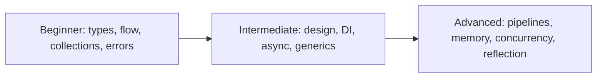

# C# Fundamentals Curriculum

[← Repository home](../README.md)

## Beginner

- [Variables, Types, and Nullability](./beginner/variables-and-types.md)
- [Control Flow and Method Design](./beginner/control-flow-and-methods.md)
- [Collections and LINQ](./beginner/collections-and-linq.md)
- [Exceptions and Validation](./beginner/exceptions-and-validation.md)
## Intermediate

- [Object-Oriented Design and SOLID](./intermediate/object-oriented-design.md)
- [Interfaces and Dependency Injection](./intermediate/interfaces-and-dependency-injection.md)
- [Async/Await and Cancellation](./intermediate/async-await.md)
- [Generics and Repository Boundaries](./intermediate/generics-and-repositories.md)
## Advanced

- [Delegates, Events, and Pipelines](./advanced/delegates-events-pipelines.md)
- [Memory, Allocation, and Performance](./advanced/memory-and-performance.md)
- [Concurrency and Thread Safety](./advanced/concurrency-and-thread-safety.md)
- [Reflection and Metadata](./advanced/reflection-and-metadata.md)

## Recommended Order

Every chapter contains a backend scenario, production notes, common mistakes, best practices, interview prompts, and adjacent-page navigation.
