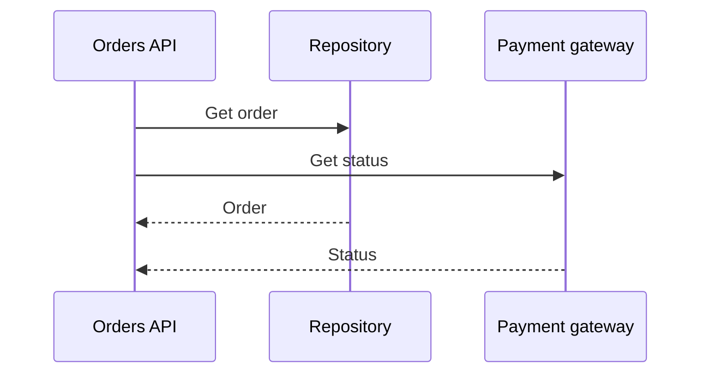

# Async/Await and Cancellation

[← Curriculum](../README.md) · [Home](../../README.md) · [← Interfaces and Dependency Injection](../intermediate/interfaces-and-dependency-injection.md) · [Generics and Repository Boundaries →](../intermediate/generics-and-repositories.md)

**Level:** Intermediate

## Overview

Async code releases a thread while waiting for I/O; `await` composes completion, exceptions, and cancellation.

## Why It Matters

Backend throughput is often dependency-bound. Blocking async work wastes request capacity and delays shutdown.

## Core Concepts

| # | Working principle |
| ---: | --- |
| 1 | Tasks are promises of completion |
| 2 | Cooperative cancellation |
| 3 | Safe concurrency with `Task.WhenAll` |



## Practical Backend Example

```csharp
public async Task<OrderDetails> GetAsync(Guid orderId, CancellationToken token)
{
    var orderTask = orders.GetAsync(orderId, token);
    var paymentTask = payments.GetStatusAsync(orderId, token);

    await Task.WhenAll(orderTask, paymentTask);
    return new OrderDetails(await orderTask, await paymentTask);
}
```

The example focuses on one production concern. Supporting domain types are omitted when they do not change the lesson.

## Production Notes

- Keep async end-to-end.
- Set explicit network timeouts.
- Measure dependency concurrency limits.

## Common Mistakes

- Calling `.Result` or `.Wait()`.
- Using `async void` outside events.
- Starting unobserved tasks.

## Best Practices

- Propagate cancellation tokens.
- Parallelize only independent work.
- Observe every task and failure.

## Interview Questions

1. Does `await` create a thread?
2. How does cancellation flow?
3. When can parallel calls overload a dependency?

<details>
<summary>Answering strategy</summary>

State the language rule, give a backend example, explain the trade-off, and describe the production failure caused by misuse.

</details>

## References

- [C# documentation](https://learn.microsoft.com/dotnet/csharp/)
- [C# language reference](https://learn.microsoft.com/dotnet/csharp/language-reference/)
- [.NET API browser](https://learn.microsoft.com/dotnet/api/)

---

[← Curriculum](../README.md) · [Home](../../README.md) · [← Interfaces and Dependency Injection](../intermediate/interfaces-and-dependency-injection.md) · [Generics and Repository Boundaries →](../intermediate/generics-and-repositories.md)
