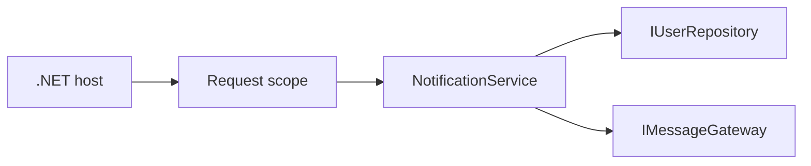

# Interfaces and Dependency Injection

[← Curriculum](../README.md) · [Home](../../README.md) · [← Object-Oriented Design and SOLID](../intermediate/object-oriented-design.md) · [Async/Await and Cancellation →](../intermediate/async-await.md)

**Level:** Intermediate

## Overview

Interfaces describe behavior needed by consumers; dependency injection composes implementations with explicit ownership and lifetime.

## Why It Matters

Lifetime mismatches can leak request state, retain resources, or fail only under production concurrency.

## Core Concepts

| # | Working principle |
| ---: | --- |
| 1 | Consumer-focused interfaces |
| 2 | Singleton, scoped, and transient lifetimes |
| 3 | Explicit constructor dependencies |



## Practical Backend Example

```csharp
public interface IUserRepository
{
    Task<User?> FindAsync(Guid userId, CancellationToken cancellationToken);
}

public sealed class NotificationService(IUserRepository users, IMessageGateway messages)
{
    public async Task NotifyAsync(Guid userId, string message, CancellationToken token)
    {
        var user = await users.FindAsync(userId, token)
            ?? throw new InvalidOperationException("User was not found.");
        await messages.SendAsync(user.Email, message, token);
    }
}
```

The example focuses on one production concern. Supporting domain types are omitted when they do not change the lesson.

## Production Notes

- Match lifetimes to owned resources.
- Validate registrations at startup.
- Create scopes for background work.

## Common Mistakes

- Injecting scoped services into singletons.
- Using the container as a service locator.
- Creating giant shared interfaces.

## Best Practices

- Keep constructors honest.
- Design interfaces for consumers.
- Document disposal expectations.

## Interview Questions

1. Why is scoped-in-singleton unsafe?
2. Where should an interface live?
3. When should a worker create a scope?

<details>
<summary>Answering strategy</summary>

State the language rule, give a backend example, explain the trade-off, and describe the production failure caused by misuse.

</details>

## References

- [C# documentation](https://learn.microsoft.com/dotnet/csharp/)
- [C# language reference](https://learn.microsoft.com/dotnet/csharp/language-reference/)
- [.NET API browser](https://learn.microsoft.com/dotnet/api/)

---

[← Curriculum](../README.md) · [Home](../../README.md) · [← Object-Oriented Design and SOLID](../intermediate/object-oriented-design.md) · [Async/Await and Cancellation →](../intermediate/async-await.md)
